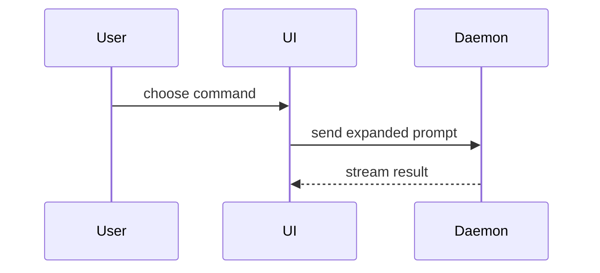

# PR body

Use this template when creating a PR or rewriting an existing body. Adapted from the [show-me skill](https://github.com/humanlayer/skills/blob/main/plugins/show-me/skills/show-me/SKILL.md) by Dex Horthy (HumanLayer).

```markdown
## Summary

<diagram, diff-sketch, or tree>

## Evidence

- **Before:** <screenshot/output/failing test run>
  **After:** <screenshot/output/passing test run>

## Merge Danger

**Door:** <one-way or two-way>

<optional: description>

**Blast Radius:** <one-word description>

<optional: potential ramifications of merge>
```

If the repository has a PR template (`.github/pull_request_template.md`, `.github/PULL_REQUEST_TEMPLATE/`, `docs/pull_request_template.md`), it wins: fill its headings and put these sections inside or after them where they fit. Keep anything below that is not ours to drop: closing keywords and issue links (`Closes #12`), a human-written description or reviewer notes, checklists, bot-managed blocks (release notes, preview links, stacked-PR tables). Fold the useful parts of an existing description into the new sections instead of deleting them.

Skip all preambles and keep prose brief. Use the domain language from the repository's glossary (`GLOSSARY.md`, `CONTEXT.md` or equivalent) when it has one. The title follows the repository's commit convention.

## Summary

Pick the smallest view that makes the key point clear. Read the full diff against the base (`gh pr diff`) before choosing; the view describes the whole PR, not the last commit.

- Logic or an algorithm as pseudocode:

```text
on(save)
  if content is unchanged
    return cached result
  write new content
  return fresh result
```

- Runtime control flow as a call tree:

```text
submitForm
  createSession
    persistPrompt
    launchAgent
  navigateToSession
```

- UI structure as a component tree, with the state and module boundaries that matter:

```text
<SessionPage> (apps/example/src/routes/session.tsx)
  useSessionEvents()
  <SessionToolbar>
    <RunSkillButton> (packages/ui)
```

- File responsibility or a broad refactor as a shallow file tree:

```text
src/
├── commands/       # parses user actions
├── sessions/       # owns session state
└── transport/      # sends API requests
```

- Component interaction, control flow or data flow as Mermaid (GitHub renders it):



- A `diff` block when the point is what changes and the surrounding shape already exists. Match the diff to the topic: a component tree, file layout, call tree or control flow.

```diff
 submitForm
   createSession
     persistPrompt
+    expandSkillMention
     launchAgent
-  navigateToSession
+  navigateToSession
+    subscribeToEvents
```

```diff
 src/
 ├── commands/
+│   └── show-me.ts       # expands the slash command
 ├── sessions/
-└── transport.ts
+└── transport/
+    ├── client.ts
+    └── stream.ts
```

- The whole block when most of it is new, when omitted context would hide ownership or order, or when the reader needs a copyable target shape.

Place each visual next to the short text it supports. Keep only the calls, files, props, states and boundaries a reviewer needs. One view is usually enough, two at most; do not use them all.

## Evidence

Concrete proof that the change works, as a before and after. Only include what you actually ran or observed; never invent output or describe a run you did not see.

- **Screenshots** are best when the change is visual and the environment can produce them. `gh` cannot upload images into a PR body, so reuse an image the author already attached, or link a CI artifact; otherwise fall back to output.
- **Execution** is next best: the exact test that failed before and passes now (as pseudocode or its name), console output, or the failing and passing CI runs for the same check, linked.
- No evidence available (a docs-only or config-only change): say what was checked, in one line.

## Merge Danger

**Door.** Two-way if a revert undoes it cleanly; one-way if it cannot be walked back: data migrations or deletions, published packages or releases, external API calls, sent notifications, renamed public contracts other systems depend on.

**Blast Radius.** One word for the widest scope it can hit (`local`, `module`, `app`, `consumers`, `data`), then the concrete ramifications worth a reviewer's attention: layout shift, mobile responsiveness, breakage for API or package consumers, performance, migration lock time. Consider all of them; list only the ones that apply.
